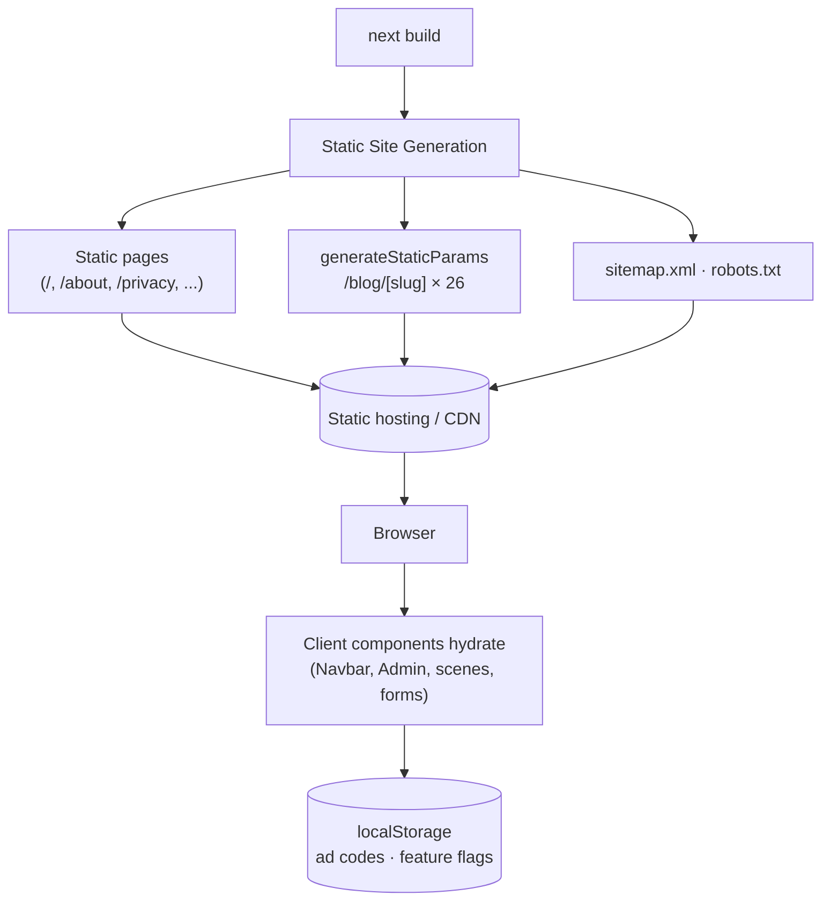
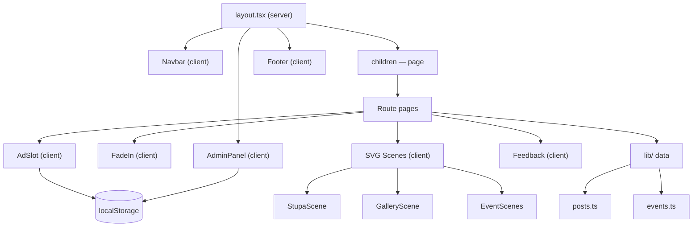
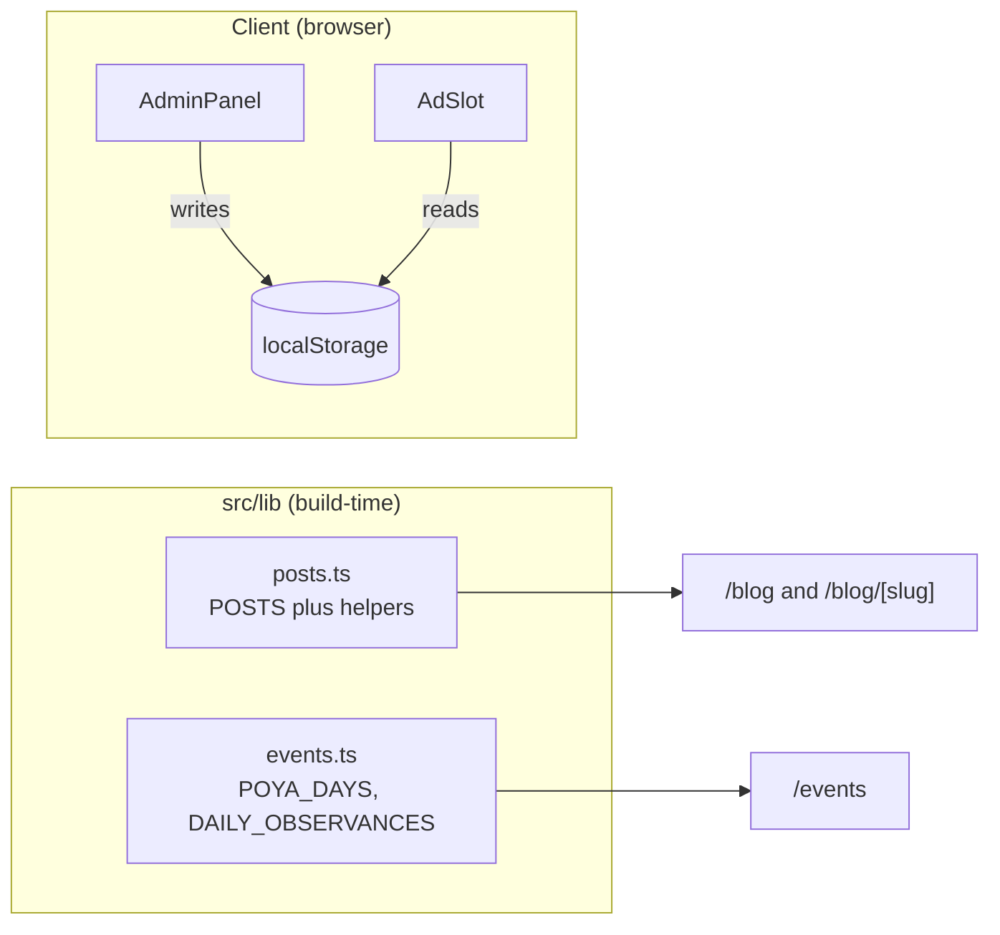
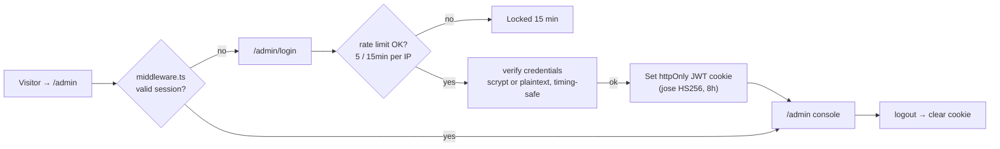

# Ruwanwelisaya — The Great Stupa of Anuradhapura

A production [Next.js 15](https://nextjs.org/) website for the **Ruwanwelisaya Maha Stupa**, a Buddhist heritage site in Anuradhapura, Sri Lanka. Fully responsive, SEO-optimized, and integrated with Google AdSense, with hand-drawn animated SVG scene illustrations for each festival and time of day.


> This codebase was implemented from a [Claude Design](https://claude.ai/design) handoff bundle. The original prototypes and design transcripts are preserved under [`project/`](project/).

---

## Table of Contents

- [Features](#features)
- [Tech Stack](#tech-stack)
- [Quick Start](#quick-start)
- [Project Structure](#project-structure)
- [Architecture](#architecture)
  - [Rendering Model](#rendering-model)
  - [Component Map](#component-map)
  - [Data Flow](#data-flow)
  - [Page Routes](#page-routes)
- [Google AdSense Integration](#google-adsense-integration)
- [Admin Console](#admin-console)
- [SEO](#seo)
- [Styling](#styling)
- [Deployment](#deployment)
- [Development Workflow](#development-workflow)
- [Roadmap](#roadmap)

---

## Features

| Area | Description |
|------|-------------|
| 🏛️ **Home** | Animated SVG stupa hero, history, daily Dhamma quote, gallery & blog previews, donate CTA |
| 📅 **Events** | Interactive calendar of the 12 Sinhala Poya days + 5 daily temple observances, with per-event detail views |
| 🖼️ **Gallery** | Filterable masonry grid of animated scene illustrations (golden hour, night, devotion, etc.) |
| 📝 **Blog** | 26+ in-depth articles with categories, featured posts, related posts, and per-article SEO + JSON-LD |
| 🪔 **Community** | "Light a virtual lamp" interaction with a live counter, plus a pilgrim reflections forum |
| ❤️ **Donate** | Donation flow supporting Stripe (card), PayPal, and bank transfer, with fund allocation breakdown |
| ℹ️ **Static pages** | About, Contact, Privacy Policy — required and structured for AdSense approval |
| 🔐 **Admin** | Login-protected `/admin` dashboard (httpOnly JWT session + route middleware) to manage ads, payments & feature flags |
| 📢 **Ads** | Real Google AdSense units (env publisher ID + per-slot ID), with custom-HTML fallback, all configurable from the Admin console |
| 🍪 **Consent** | Cookie-consent banner gating ad cookies; ads load only after consent (EEA/UK-friendly) |
| 🔍 **SEO** | Metadata API, Open Graph, Twitter cards, JSON-LD structured data, `sitemap.xml`, `robots.txt`, `ads.txt` |
| 🎬 **Animation** | Scroll-reveal (`FadeIn`) + CSS keyframe animations on every SVG scene (lantern sway, flame flicker, bird drift, petal fall) |

---

## Tech Stack

- **Framework:** Next.js 15 (App Router)
- **Language:** TypeScript 5
- **UI:** React 18 (server + client components)
- **Styling:** Plain CSS with custom properties (design tokens) — no CSS framework
- **Fonts:** `next/font/google` — Cinzel (display) + Inter (body)
- **Icons / Art:** Inline SVG (no image assets, no external requests)
- **Auth:** Edge middleware + signed JWT session ([`jose`](https://github.com/panva/jose)), scrypt password hashing, login rate limiting, security headers
- **Persistence:** `localStorage` (ad codes, feature flags) — no database required

---

## Quick Start

### Prerequisites

- **Node.js** ≥ 18.17 (LTS recommended)
- **npm** ≥ 9 (or pnpm / yarn)

### Install & run

```bash
# 1. Install dependencies
npm install

# 2. Set up environment variables (admin login, etc.)
cp .env.example .env.local
#   then edit .env.local — at minimum set ADMIN_PASSWORD and AUTH_SECRET

# 3. Start the dev server (http://localhost:3000)
npm run dev

# 4. Production build
npm run build

# 5. Serve the production build
npm start
```

### Environment variables

Copy `.env.example` → `.env.local` and fill these in (the app falls back to insecure dev defaults if unset, so **always set them in production**):

| Variable | Required | Description |
|----------|----------|-------------|
| `ADMIN_USERNAME` | recommended | Username for the `/admin` login (default `admin`) |
| `ADMIN_PASSWORD` | one of these | Plaintext admin password |
| `ADMIN_PASSWORD_HASH` | one of these | **Recommended** — scrypt hash; takes precedence. Generate with `node scripts/hash-password.mjs '<pass>'` |
| `AUTH_SECRET` | **yes (prod)** | Secret that signs the admin session JWT — 32+ random chars (`openssl rand -base64 32`) |
| `NEXT_PUBLIC_ADSENSE_CLIENT` | optional | Your AdSense publisher ID, e.g. `ca-pub-…` |

### Scripts

| Command | Description |
|---------|-------------|
| `npm run dev` | Start the development server with hot reload |
| `npm run build` | Create an optimized production build (42 routes) |
| `npm start` | Serve the production build |

---

## Project Structure

```
.
├── public/
│   └── ads.txt                 # Google AdSense ads.txt (authorized sellers)
├── src/
│   ├── app/                    # App Router: routes, layouts, metadata
│   │   ├── layout.tsx          # Root layout: fonts, metadata, JSON-LD, Navbar/Footer/Admin
│   │   ├── page.tsx            # Home (/)
│   │   ├── globals.css         # All design tokens + component styles (~1180 lines)
│   │   ├── sitemap.ts          # Dynamic sitemap.xml (static routes + blog slugs)
│   │   ├── robots.ts           # robots.txt
│   │   ├── events/page.tsx     # /events
│   │   ├── gallery/page.tsx    # /gallery
│   │   ├── blog/
│   │   │   ├── page.tsx        # /blog index
│   │   │   └── [slug]/page.tsx # /blog/:slug (generateStaticParams + generateMetadata)
│   │   ├── community/page.tsx  # /community
│   │   ├── donate/page.tsx     # /donate
│   │   ├── about/page.tsx      # /about
│   │   ├── contact/page.tsx    # /contact
│   │   ├── privacy/page.tsx    # /privacy
│   │   └── admin/             # 🔐 Login-protected admin console
│   │       ├── actions.ts      # Server actions: login (rate-limited) / logout
│   │       ├── page.tsx        # /admin dashboard (session-gated, dynamic)
│   │       └── login/page.tsx  # /admin/login form
│   ├── middleware.ts           # Protects /admin/* (redirects to login)
│   ├── components/             # Reusable UI + SVG scene components
│   │   ├── Navbar.tsx          # Sticky nav, solid off-home, hidden on /admin
│   │   ├── Footer.tsx          # Links + newsletter form, hidden on /admin
│   │   ├── AdSlot.tsx          # AdSense unit → custom HTML → placeholder (consent-aware)
│   │   ├── AdSense.tsx         # Loads AdSense library (env ID + consent)
│   │   ├── ConsentBanner.tsx   # Cookie-consent banner
│   │   ├── AdminDashboard.tsx  # Sidebar console: Overview/Ads/Appearance/Payments/Security
│   │   ├── FadeIn.tsx          # IntersectionObserver scroll-reveal wrapper
│   │   ├── Feedback.tsx        # Star-rating feedback form
│   │   ├── Icon.tsx            # Inline SVG icon set + Mark/Lotus/LotusDivider
│   │   ├── StupaScene.tsx      # Animated hero stupa illustration
│   │   ├── GalleryScene.tsx    # 7 gallery scene illustrations (dispatcher)
│   │   └── EventScenes.tsx     # Festival scenes (Vesak / Poson / Esala / Poya / Alms)
│   └── lib/                    # Typed data + auth layer (no DB)
│       ├── posts.ts            # Blog posts + helpers (getPost, getRelatedPosts)
│       ├── events.ts           # Poya days + daily observances
│       ├── auth.ts             # Edge-safe session JWT (jose)
│       ├── credentials.ts      # Node-only credential check (scrypt / plaintext)
│       ├── rate-limit.ts       # In-memory login rate limiter
│       └── consent.ts          # Cookie-consent state (shared by ads + banner)
├── scripts/
│   └── hash-password.mjs       # Generate ADMIN_PASSWORD_HASH (scrypt)
├── .env.example                # Documents required environment variables
├── SECURITY.md                 # Security posture & hardening guide
├── project/                    # Original Claude Design handoff bundle (prototypes, transcripts)
├── docs/                       # Architecture & AdSense deep-dive docs
├── next.config.mjs            # Security headers, image config
├── tsconfig.json              # Path alias: @/* → ./src/*
└── package.json
```

---

## Architecture

### Rendering Model

All public content is **statically generated** — every content route prerenders to HTML at build time (26 blog posts among them). There is no database; interactive features run client-side and persist to `localStorage`. The only server-side pieces are the **auth middleware** and the dynamic **`/admin`** route.



### Component Map

Server components hold the page shells and metadata; `'use client'` components handle interactivity (scroll animation, forms, state, browser APIs).



### Data Flow

There is no API. Content lives in typed TypeScript modules under `src/lib/`:



- **`posts.ts`** exports `POSTS`, `CATEGORIES`, and helpers `getPost(slug)`, `getPostsByCategory(cat)`, `getRelatedPosts(slug, n)`.
- **`events.ts`** exports `POYA_DAYS` (12 full-moon days) and `DAILY_OBSERVANCES` (5 daily rituals), with TypeScript interfaces.
- **`localStorage` keys:** `rw_ad_{slotId}` (ad HTML), `rw_flags` (feature toggles), `rw_payments` (enabled payment methods).

### Page Routes

| Route | File | Rendering | Notes |
|-------|------|-----------|-------|
| `/` | `app/page.tsx` | Static | Hero scene, previews, AdSlots, donate CTA |
| `/events` | `app/events/page.tsx` | Static (client) | Poya calendar + detail views |
| `/gallery` | `app/gallery/page.tsx` | Static (client) | Filterable masonry |
| `/blog` | `app/blog/page.tsx` | Static (client) | Featured + grid + filter |
| `/blog/[slug]` | `app/blog/[slug]/page.tsx` | SSG × 26 | `generateStaticParams` + `generateMetadata` + JSON-LD |
| `/community` | `app/community/page.tsx` | Static (client) | Virtual lamp + forum |
| `/donate` | `app/donate/page.tsx` | Static (client) | Stripe / PayPal / Bank |
| `/about` `/contact` `/privacy` | `app/*/page.tsx` | Static | AdSense-required pages |
| `/admin/login` | `app/admin/login/page.tsx` | Static | Login form (server action) |
| `/admin` | `app/admin/page.tsx` | Dynamic | Session-gated dashboard (middleware-protected) |
| `/sitemap.xml` `/robots.txt` | `app/sitemap.ts` `app/robots.ts` | Generated | SEO |

---

## Google AdSense Integration

AdSense works through environment + the admin console — no code edits needed. The library loads **only after the visitor consents** to ad cookies. Full guide: **[docs/ADSENSE.md](docs/ADSENSE.md)**.

### Steps to go live

1. **Set your publisher ID** as an env var (the loader is wired automatically):

   ```
   NEXT_PUBLIC_ADSENSE_CLIENT=ca-pub-XXXXXXXXXXXXXXXX
   ```

2. **Update `public/ads.txt`** with the same publisher ID:

   ```
   google.com, pub-XXXXXXXXXXXXXXXX, DIRECT, f08c47fec0942fa0
   ```

3. **Add a per-slot ad-slot ID** in **Admin → Advertisements** for each slot you want live.

### How `AdSlot` resolves what to render

```
AdSense unit   →  if NEXT_PUBLIC_ADSENSE_CLIENT + per-slot ad-slot ID + consent granted
custom HTML    →  else, if HTML was saved for the slot in the admin console
placeholder    →  otherwise (labelled "Configure in Admin → Advertisements")
```

The AdSense library (`components/AdSense.tsx`) is injected via `next/script` only when a publisher ID is set **and** the visitor has accepted ad cookies in the consent banner.

### Ad slot inventory

| Slot ID | Size | Location |
|---------|------|----------|
| `home-top` | leaderboard | Home, below info bar |
| `home-mid` | leaderboard | Home, between gallery and blog |
| `home-bottom` | rectangle | Home footer / Events page |
| `blog-sidebar` | rectangle | Blog detail (reserved) |
| `blog-inline` | leaderboard | Inside article body (~⅓ down) |

### Cookie consent

`ConsentBanner` shows on first visit and stores the choice (`localStorage`). Ads load only on **Accept**; **Decline** keeps essential cookies only. Visitors can change their choice anytime via **Cookie settings** in the footer. This is a basic mechanism — for full EEA/UK/CH compliance, pair it with a Google-certified CMP.

---

## Admin Console

A redesigned, **login-protected** admin console lives at **`/admin`** (also linked discreetly in the footer). Unauthenticated visitors are redirected to **`/admin/login`**. Full security details: **[SECURITY.md](SECURITY.md)**.

### How auth works



### Security features

- **Edge middleware** guards every `/admin/*` route (`src/middleware.ts`).
- **Signed JWT session** (`jose`, HS256, 8h) in an **httpOnly**, `sameSite=lax`, `secure` (prod) cookie.
- **Credentials from env** — `ADMIN_USERNAME` + `ADMIN_PASSWORD`, or a **scrypt** `ADMIN_PASSWORD_HASH` (recommended). Both compared with timing-safe routines.
- **Login rate limiting** — 5 failed attempts / 15 min per IP → lockout.
- **Security headers** — `X-Frame-Options: DENY`, `no-store`, `noindex` on `/admin` (see `next.config.mjs`).
- **Edge/Node split** — `node:crypto` lives in `credentials.ts`; the edge bundle only carries the `jose` session helpers.

### Console sections

| Section | Purpose |
|---------|---------|
| **Overview** | Session status, content/ad/payment stats, security health, quick links |
| **Advertisements** | Publisher-ID status + per-slot AdSense ad-slot ID and custom-HTML fallback, with status pills, live preview, save / demo / clear |
| **Appearance** | Feature flags: `showAds`, `festivalBanner`, `lampCounter`, `animations` |
| **Payments** | Toggle Stripe, PayPal, Bank on the donate page |
| **Security** | Session details, credential checklist, hardening tips, reset (danger zone) |

Ad codes and flags persist to `localStorage` (per-browser); the console itself is gated behind login.

> **Note:** Login authenticates *access to the console*; ad config is still stored per-browser in `localStorage`. For shared, server-side ad configuration, see the [Roadmap](#roadmap).

---

## SEO

- **Metadata API** — per-page `title`, `description`, keywords, Open Graph, and Twitter cards via Next.js `Metadata`.
- **Structured data (JSON-LD):**
  - `WebSite` + `LandmarksOrHistoricalBuildings` in the root layout
  - `Article` per blog post (`generateMetadata` + inline `<script type="application/ld+json">`)
- **`sitemap.xml`** — generated from static routes + all blog slugs (`app/sitemap.ts`).
- **`robots.txt`** — allows all, points to the sitemap (`app/robots.ts`).
- **`ads.txt`** — authorized digital sellers declaration.
- **Semantic HTML** — single `<h1>` per page, landmark regions, `alt`/`aria` on interactive elements.

---

## Styling

All styling lives in `src/app/globals.css` as plain CSS with custom-property design tokens (colors, spacing, typography). Class names use the `rw-` prefix (e.g. `rw-hero`, `rw-post-card`). There is **no Tailwind or CSS-in-JS** — the design tokens come straight from the original design system.

Two Google fonts are exposed as CSS variables via `next/font`:

- `--font-cinzel` — display / headings
- `--font-inter` — body / UI

---

## Deployment

The app is a standard Next.js project and deploys anywhere Next.js is supported.

### Vercel (recommended)

```bash
# Connect the GitHub repo at vercel.com/new, or:
npx vercel
```

### Any Node host

```bash
npm run build
npm start    # serves on $PORT (default 3000)
```

> **Set environment variables on your host** (`ADMIN_USERNAME`, `ADMIN_PASSWORD`, `AUTH_SECRET`) — see [Environment variables](#environment-variables). On Vercel, add them under *Project → Settings → Environment Variables*.

> **Note on hosting:** because of the auth **middleware** and the dynamic `/admin` route, the app needs an edge/Node runtime (Vercel, Netlify, a Node server, etc.) — it is **not** a pure static export. All public content pages remain statically generated for speed.

---

## Development Workflow

This repository is maintained with living documentation. **Every future change should keep the docs in sync:**

1. Create a feature branch.
2. Make the change. If it adds/alters a page, component, data shape, route, or ad slot:
   - Update the relevant section of this **README**.
   - Update **[docs/ARCHITECTURE.md](docs/ARCHITECTURE.md)** and the Mermaid diagrams if the structure changed.
   - Add an entry to **[CHANGELOG.md](CHANGELOG.md)**.
3. Run `npm run build` to confirm a clean type-checked build.
4. Commit with a descriptive message and push.

See **[docs/ARCHITECTURE.md](docs/ARCHITECTURE.md)** for the deep-dive and **[docs/ADSENSE.md](docs/ADSENSE.md)** for the full ad-setup guide.

---

## Roadmap

- [x] Authenticated admin with login + session middleware
- [x] Admin hardening — scrypt passwords, login rate limiting, security headers
- [x] End-to-end AdSense (env publisher ID + per-slot IDs) with cookie-consent gating
- [x] Next.js 15 upgrade — `found 0 vulnerabilities`
- [ ] Pair consent banner with a Google-certified CMP for full EEA/UK compliance
- [ ] Server-side ad/config storage (shared across browsers, not just localStorage)
- [ ] Real backend for forum posts, photo uploads, and the lamp counter
- [ ] Live Stripe / PayPal payment processing (currently UI-only)
- [ ] Newsletter integration (currently UI-only)
- [ ] i18n (Sinhala / Tamil / English)
- [ ] Real photography to complement the SVG scenes

---

## License

MIT — see [LICENSE](LICENSE).

🙏 _May this work bring merit and be of benefit to all who visit._
