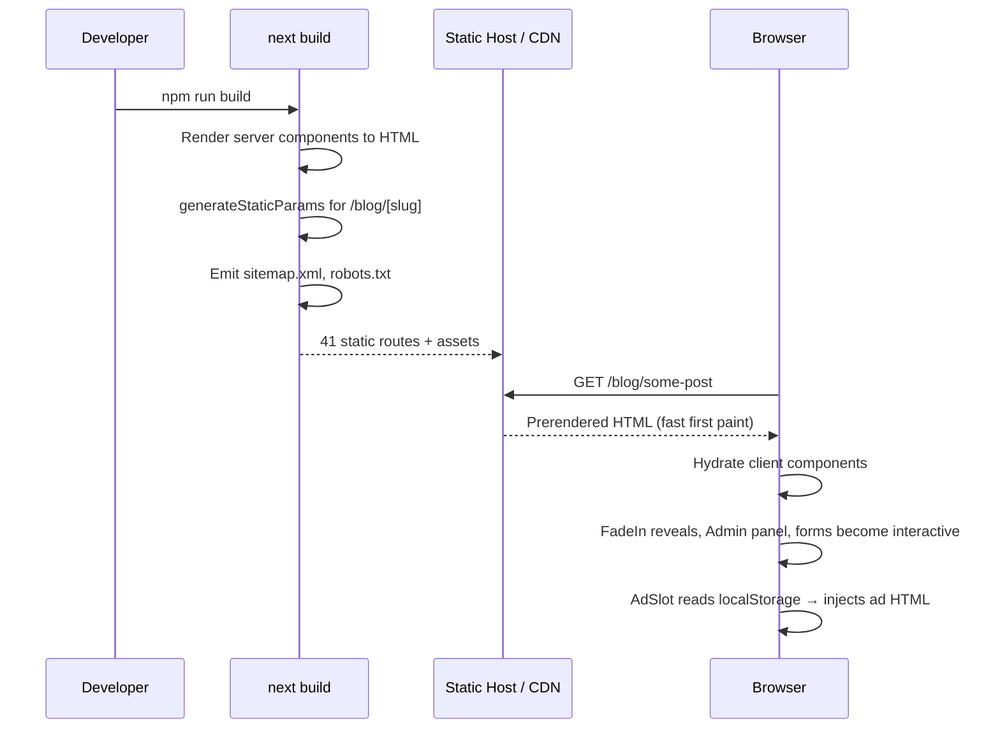
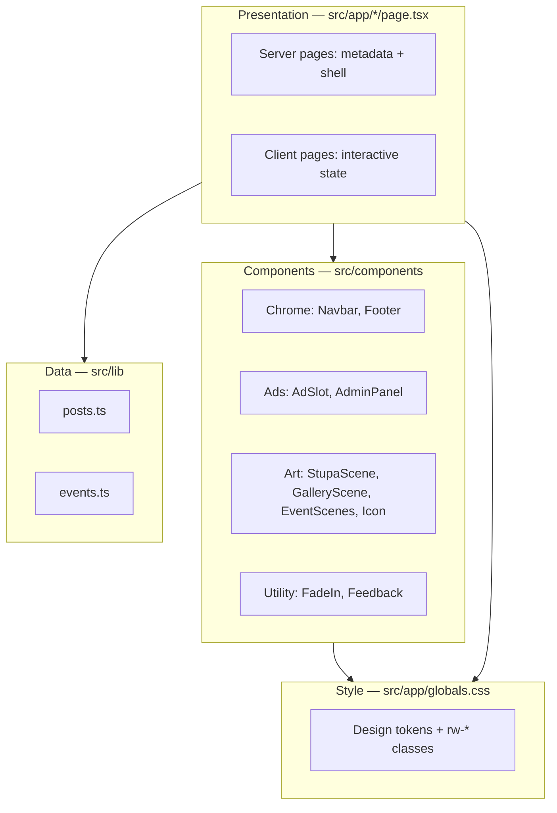
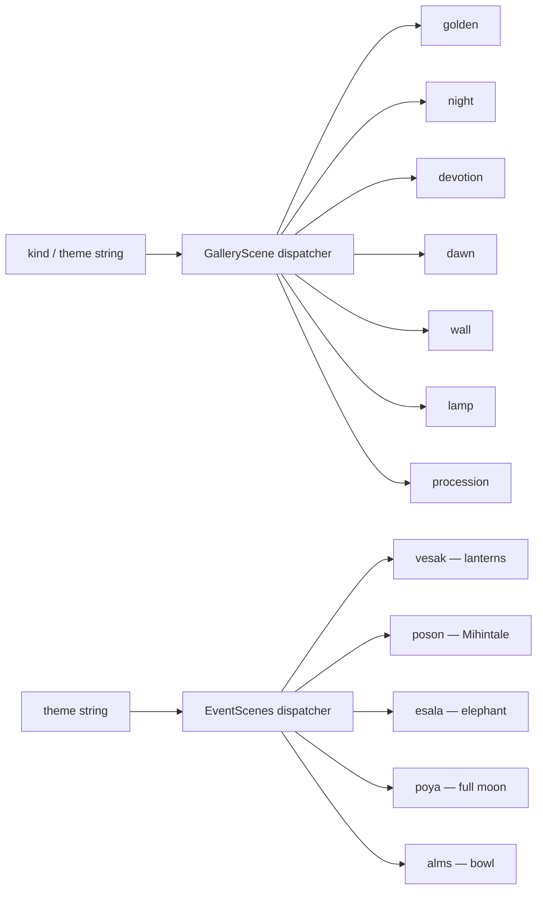
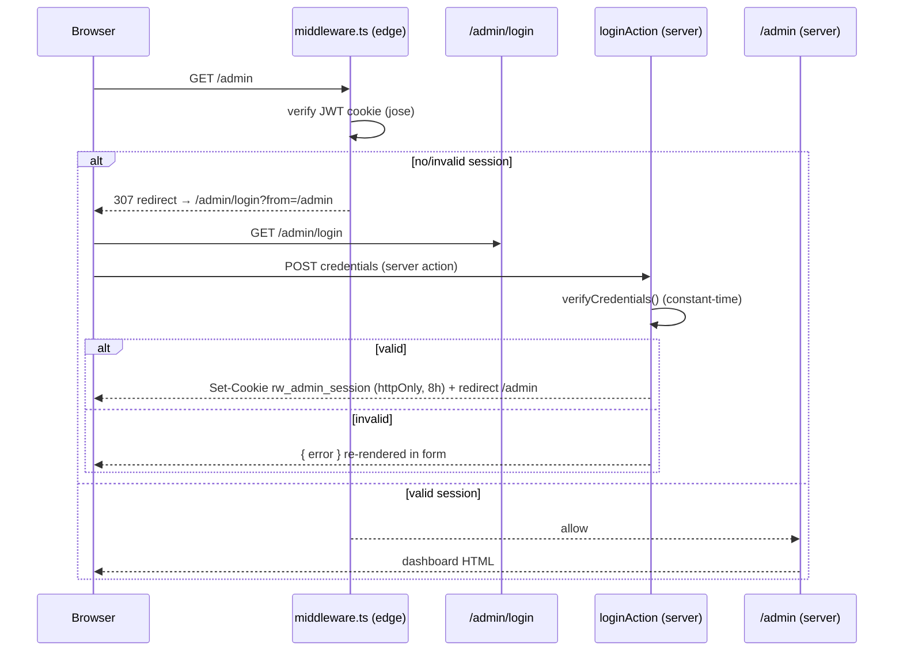
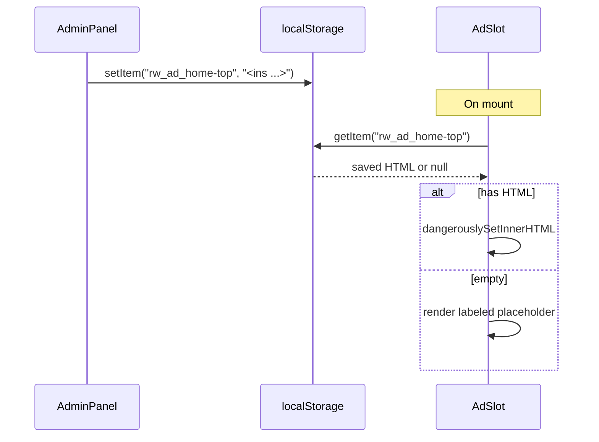

# Architecture

This document is the deep-dive companion to the [README](../README.md). It explains *why* the code is shaped the way it is, and is the canonical reference to keep updated as the project evolves.

## 1. Guiding principles

1. **No backend until it's needed.** All content is build-time data; all interactivity is client-side. This keeps hosting free/cheap, fast, and trivially scalable behind a CDN.
2. **Server-first components.** Pages are server components by default; `'use client'` is added only where a component needs state, effects, refs, or browser APIs.
3. **Art is code.** Every illustration is inline SVG + CSS animation — zero image requests, infinitely scalable, themeable with CSS variables.
4. **Preserve the design system.** CSS class names and tokens come verbatim from the Claude Design prototype so the visual output matches pixel-for-pixel.

## 2. Request lifecycle



## 3. Layered structure



## 4. Server vs. client components

| Component | Type | Why |
|-----------|------|-----|
| `layout.tsx` | server | Static metadata, JSON-LD, font wiring |
| `app/page.tsx`, `about`, `privacy`, `blog/[slug]` | server | No client state; better SEO + smaller JS |
| `app/admin/page.tsx` | server (dynamic) | Reads the session cookie; renders dashboard + logout |
| `events`, `gallery`, `blog` (index), `community`, `donate`, `contact` | client | `useState` for filters / forms / detail views |
| `app/admin/login/page.tsx` | client | `useFormState` / `useFormStatus` for the login form |
| `Navbar`, `Footer` | client | Scroll listener, form state, hide-on-`/admin` |
| `AdSlot`, `AdminDashboard` | client | `localStorage` read/write |
| `FadeIn` | client | `IntersectionObserver` |
| `Feedback` | client | Form state |
| `StupaScene`, `GalleryScene`, `EventScenes` | client | Marked client for animation parity (could be server later) |
| `Icon` | server-safe | Pure SVG, no hooks |
| `middleware.ts` | edge | Verifies the session JWT on every `/admin/*` request |
| `app/admin/actions.ts` | server action | `loginAction` / `logoutAction` (set/clear cookie) |
| `lib/auth.ts` | server/edge | JWT sign/verify (`jose`) + credential check |

> **Optimization note:** the SVG scenes don't strictly need to be client components — they have no hooks. Converting them to server components would shrink the client bundle. Tracked in the roadmap.

## 5. The data layer (`src/lib`)

### `posts.ts`

```ts
interface Post {
  slug: string; title: string; excerpt: string;
  category: string; author: string; when: string; read: string;
  kind: string;                 // which GalleryScene illustration to show
  seo: { description: string; keywords: string[] };
  body: BodyBlock[];            // structured content blocks
}
type BodyBlock = { type: 'p'|'h2'|'h3'|'quote'|'list'; text?: string; items?: string[] };
```

Helpers: `getPost(slug)`, `getPostsByCategory(category)`, `getRelatedPosts(slug, count)`, plus `CATEGORIES`.

`/blog/[slug]` calls `generateStaticParams()` over `POSTS` so each article is prerendered, and `generateMetadata()` produces per-post title/description/OG/Twitter/JSON-LD.

### `events.ts`

- `POYA_DAYS: PoyadDay[]` — the 12 named full-moon days, each with `theme` (drives the `EventScenes` illustration), `details[]`, and an optional `extended` flag for long-form content.
- `DAILY_OBSERVANCES: DailyObservance[]` — 5 daily temple rituals.

The `/events` page renders both as cards and swaps to an inline detail view via local state (no route change).

## 6. The art system



Each scene is a `<div className="rw-scene">` wrapping an SVG; motion (lantern sway, flame flicker, bird drift, petal fall, glow pulse) is defined as CSS `@keyframes` in `globals.css`, gated by the `animations` feature flag conceptually.

## 6b. Authentication

The `/admin` area is the one authenticated surface. It uses a stateless,
cookie-based session — no session store or database.



**Design choices**

- **`jose`** is used (not `jsonwebtoken`) because it runs in the **edge runtime** where the middleware executes.
- The token is **HS256**, signed with `AUTH_SECRET`, carrying `{ username, role: 'admin' }`, expiring in 8h.
- Cookie is **httpOnly** (no JS access), `sameSite=lax`, `secure` in production.
- Credentials live in **env vars** (`ADMIN_USERNAME` / `ADMIN_PASSWORD`); insecure dev defaults are used only when unset, and `/admin` shows a warning banner in that case (`usingDefaultCredentials()`).
- This is **single-operator** auth. For multiple users / roles, swap `lib/auth.ts` for a provider like Auth.js — the middleware contract (`verifySessionToken`) stays the same.

## 7. Ads & admin



Keys: `rw_ad_{slotId}`, `rw_flags`, `rw_payments`. See [ADSENSE.md](ADSENSE.md) for the production wiring.

## 8. Extending the site

| Task | Where |
|------|-------|
| Add a blog post | Append to `POSTS` in `src/lib/posts.ts` (slug becomes the route) |
| Add a Poya day / ritual | Edit `POYA_DAYS` / `DAILY_OBSERVANCES` in `src/lib/events.ts` |
| Add a gallery image | Add to the `GALLERY_PHOTOS` array in `app/gallery/page.tsx` (reuse a `kind`) |
| Add a new ad slot | Add the id to `SLOTS` in `AdminPanel.tsx` and drop an `<AdSlot id=…>` on the page |
| Add a new page | Create `src/app/<route>/page.tsx`, add it to `Navbar`/`Footer` links and `sitemap.ts` |
| New illustration | Add a branch to the `GalleryScene` or `EventScenes` dispatcher + CSS keyframes |
| Change admin login | Set `ADMIN_USERNAME` / `ADMIN_PASSWORD` / `AUTH_SECRET` env vars |
| Protect another route | Add its path to the `matcher` in `src/middleware.ts` |

Whenever you do any of the above, update the README tables, this document, and `CHANGELOG.md`.
